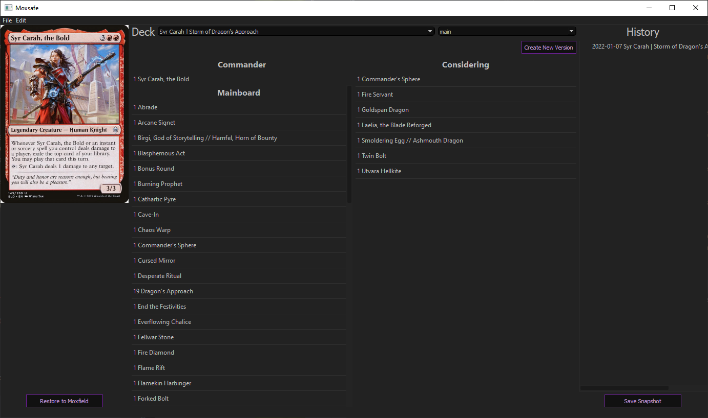

Support saving a Moxfield deck in snapshots that can later be restored.

A deck can have multiple versions that all have their own snapshots. 
Meaning that a deck might have a "Low" version and a "Mid" version that
you can change in between. Both with their own individual history in
form of snapshots. 

## Prerequisites
1. Python 3.6+

## Install the requirements
1. Change directory to the projects
2. `pip install -r requirements.txt` 

## Run
1. Change directory to the projects
2. Add a `.env` file in the Moxsafe directory
(next to this readme file) containing 
```
MOX_USER=USER_NAME
MOX_TOKEN=PASSWORD
```
that will be used when communicating with Moxfield,
if you don't plan to use the restore functionality you shouldn't need the .env file
4. `python moxsafe/mainwindow.py`


## Usage
1. Add a deck by clicking File -> Add Deck and then pasting in your deck URL
2. You will have to change to it in the Deck dropdown
3. A version can be created by clicking the "Create New Version" (these are branches)
4. A snapshot can be created by clicking on "Save Snapshot" (these are commits)
